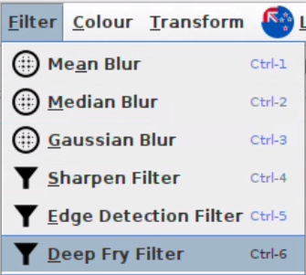

# ANDIE

Welcome to the group HHH's andie project. ANDIE is a non-destructive image editor that allows you to make adjustments to your images without permanently changing the original file. This means you can experiment with different edits and revert back to the original at any time.

## How to run ANDIE
Install java runtime and run with the following command
java -jar ANDIE.jar

## Shortcuts

On Linux/Windows the key used for mnemonics is Alt, MacOS the key used is Ctrl+Option, we refer to the mnemonic key as Alt from now on. 

A mnemonic is a key that makes an already visible menu item be chosen. For example, the edit menu has the mnemonic E (the underlined letter), so pressing Alt + E opens the Edit menu. 
Note that mnemonics are carefully selected for English NZ language, so for other languages some mnemonics will be missing.

For example the Undo menu item has the mnemonic U (since U is underlined) so pressing the U key (with or without Alt) runs the Undo action. Whereas the Key Combination/Keyboard Shortcut to the right of the Undo button causes it to be chosen whether or not it's visible unlike the mnemonic. So we could run Undo Action if the Edit menu is not open by pressing Ctrl+Z, (or Command+Z on MacOS)

Note if two buttons share the same mnemonic then clicking the mnemonic key will cycle through the options click the Enter key to confirm. 

## Sharpen Filter 
- Completed by Beckham
- Sharpen filter is a type of image filter that is used to enhance the edges and details in an image, making them appear more distinct and clear
  

-  Open image --> Open Filter menu --> Click Sharpen Filter --> Adjust offset --> Click Confirm Button 
-  We tested this filter by using the regular input, and edge cases (small and big images).We then visually inspected to see if the details and edges have become clearer and more defined, also compared to the Lab Book example. We also conducted a functional test and printed out the desired output required by the function. It was done by using a print statement and manually calculating if the desired output was the same as the calculated output.

## Gaussian Blur
- Completed by Beckham
- Gaussian blur is a type of image blur filter that is commonly used to reduce noise and smooth out the details in an image. 

- Open image --> Open Filter menu --> click Gaussian Blur -->  Input filter radius --> Click Ok button
- 
- We tested this filter by regular input, and edge cases (small and big images).We Then visually inspected  to see if the results were correct.We also conducted a functional test and printed out the desired output required by the function. It was done by using a print statement and manually calculating if the desired output was the same as the calculated output. We also performed JUnit testing to test that the output of the gaussian formula provided in the lab book matches our formula in the code.

  
## Median filter
- Completed by Beckham
- Median filter is a type of digital image processing filter that is commonly used for noise reduction and smoothing of images.
  

-  Open image --> Open Filter menu --> click Median filter --> Input filter radius --> Click Ok button
-   We tested this filter by using the regular input, and edge cases (small and big images). We Then visually inspected the image to see if the results were correct. We also conducted a functional test and printed out the desired output required by the function. Done by Using a print statement and manually calculating if the desired output was the same as the calculated output.

## Edge Detection Filters
- Completed by Max
- Sombel and Emboss filters are a form of edge detection filter which creates a raised lowered effect as if the image has been pressed into a sheet of metal. 

- Open image --> Open Filter menu --> click Edge Detection Filter --> Click ComboBox --> Select Edge Detection algorithm --> Click Confirm button
- We tested this filter by using the regular input, and edge cases (small and big images). We Then visually inspected the image to see if the results were correct.

## Extended Filterss
- Completed by Beckham
- The convolution works for the edges of the image
- Replaced convol op to extended convol op
- Tested via visual inspection as the filter got rid of the black outline.

## Mouse Selections
- Completed by Beckham
- Getting the area of the mouse's drag and drop
- used in the crop function and draw fnuctions
- Tested via visual inspection to see if selected area was selected
## ATARI Breakout
- Completed by Beckham
- Atari Breakout is a in built game where you breaking the images on the screen using a ball and a paddle.
  

- Open Image --> Open  --> Open Breakout Menu --> Click Breakout --> Press any key to start --> Use Left and Right arrow keys to move paddle. (Click Escape key or GUI X button to exit at any time).
- Tested with different sized images and came to an appropriate size to use for pong, also limited the image size to a suitable size. Ensured collisions works via inspection. us

## Keyboard Shortcuts
- Completed by Jeet and Beckham
- Mnemonics keys are used when Menu is visible whereas Macro keys can be used when Menu is not visible usually via a key combination. (See Shortcuts are the start for more info)
- Tested every macro to see correct action was activated, and that no actions shared Shortcut Keys. Tested on all major Operating Systems (MacOS, Windows, Ubuntu[Linux]) to avoid conflicts with OS shortcuts.

## Macros
- Compeleted by Beckham
- Allows user to save series of operations to .ops files which can then be ran.
- User will click start macro under Macros menu ---> perform operations they want to save --> stop macro --> save macro to desired location
- To load in a macro user must select load macro, and choose the relevant .ops file. 
- While a macro is being recorded a camera icon will appear next to the Macro drop down menu for ease of use.
- Tested Macros with all image operations, to ensure that all desired functions could be performed and saved.

## Crop
- Completed by Beckham
- Crops the image into a size that the user wants.
- Open Image --> Edit --> Crop --> drag and drop on the screen --> crop the image
- We tested with different sized images and going on and off the image during the drag and drop. Along with different sized image panels.
## Negative Filter
- Completed by Leon
- Negative filter is a way to add offset to an image. This can be seen in the preview panels of the sharpen filter and the edge detection filters. Shown in the preview panel,  where users can adjust how much offset they would want as they are previewing the image as well.

- Open Image --> Open Filter menu --> Click Sharpen or Edge Detection filter --> Move the slider to desired offset --> Click Confirm button
- We tested the offset by first checking if the applied offset to the image is correct by comparing to the lab book, then checked edge casses (highest and lowest amount of offset).

## Draw Functions 
- Completed by Beckham and Glen
- Draw function is used if the user wants to draw on a oval, line or rectangle onto their desired image. The user drags and drops their mouse on the image and then the user can select what their desired add on would be, the colour of the shape, the angle and the size of the outline if there is any.

- Open Image --> Open Shape menu --> Click Draw --> Click and Drag to Select Area --> Select Angle, Filled, Outlined, Filled Colour, Outlined Colour, Line Width, Shape Type --> click Confirm button

- Tested by trying combinations of all the options, ensuring they work in the preview image panels and jcolorchooser preview panels, make sure they apply to the correct area. 
## Deepfry Filter
- Completed by Beckham
- The deepfry filter is a filter that reduces saves the image to jpeg at 5% compression a few times, then sharpens, increases contrast and saturation and to top it off, adds some emojis to provide that deep fried look that we all know and love. 

- Open Image --> Open Filter menu --> Click DeepFry filter
- We tested this filter by using the regular input, and edge cases (small and big images). We Then visually inspected the image to see if the results were correct. Also ensured each component of the deepfry stack of operations are applied.

## Brightness and Contrast Adjustment
- Completed by Glen 
- Brightness and Contrast adjustment is a type of image processing technique that is used to change the overall brightness level of an image.

- To adjust the brightness of their image, users would upload it to Andie, then click on the "Colour" option followed by "Contrast and Brightness". They can then enter the desired amount of brightness needed (-200 to 200 inclusive) (no additional contrast is necessary), and the filter will be applied accordingly.
- To ensure its functionality, we tested this filter using regular input as well as edge cases, including small and large images. After applying the filter, we visually inspected the resulting image to confirm that the output was correct. Additionally, we conducted a functional test by using a print statement to compare the desired output required by the function with the calculated output. We also performed JUnit testing to test that the output of the brightness and contrast formula provided in the lab book matches our formula in the code.
- Users upload their image to andie --> click colour then click contrast and brightness --> input the amount of contrast needed (-200 to 200 inclusive) (Does not need extra Brightness). The contrast is then applied.
- We tested this filter by using the regular input, and edge cases (small and big images). We Then visually inspected to see if the results were correct. We also conducted a functional test and printed out the desired output required by the function. Done by Using a print statement and manually calculating if the desired output was the same as the calculated output. We also performed JUnit testing to test that the output of the brightness and contrast formula provided in the lab book matches our formula in the code.

## Toolbar for Common Operations
- Completed by Max
- Toolbar for common operations is a small icon-based menu, containing common operations, that is able to be dragged round and adjusted by user as required. All icons match to the corresponding icons in drop down menus, and hovering mouse over an icon will show a description.

- Users may click on icon contained in toolbar --> that operation will then be performed.
- We tested each operation in this toolbar, making sure it mapped to the correct output.

## Image ReSize
- Completed by Beckham
- Image resize is a process of changing the size or resolution of a digital image.

- Open Image --> Open Transform menu --> Click Resize --> Adjust scaling slider --> Click Confirm button
- The Unit tests for image resizing were done by Glen, who implemented the unit tests to take an image , then resized it by certain percentage and then ensured that the resized image was not equal to original image's dimensions. We also performed functional tests by checking whether the desired output was being supplied by the function. We also performed JUnit testing to test that the size of the image after the scale matches what we expected. 

## Image Rotations 
- Completed by Leon 
- The function of image rotation is to change the orientation of an image by rotating it by a certain angle selected by the users. 
- Open Image ---> Open Transform Menu --> Click Rotate 90 Left or Rotate 90 right or Rotate 180 

-   The tests for image rotation were generally done by checking whether the desired output was being processed correctly (i.e Selected image being rotated correct direction.).

## Image Flip
- Completed by Leon 
- The function of Image flip is to allow the user to flip the image vertically or horizontally. Generally done by changing the order of the pixels in the Y or X axis.
- Users can upload their desired image --> Select transform --> Select their desired orientation for the flip operation.

- The tests for image Flip were generally done by checking whether the desired output was being processed correctly (i.e Selected image being flipped in the direction being stated.)

## Image Export 
  - Completed by Beckham, Leon (pair programing) 
  - The function of image export allows the user to save images with all filters applied on the image.

  - Users would upload their image -->  apply the desired filters  -->  click file into export and save in the desired location,after which the image will be saved.
  - The testing was done by looking at the saved image was the image that was previously displayed on ANDIE, checked if the image type specified was correct (png or jpg)  

## Exception Handling
- Completed by Max
- Exception Handling handles exceptions and shows error messages for any exceptions hit. 
-  When users hit an exception a message box will show and let them know an error has occured. E.g if the user applies a filter with no image, a error box will show letting the user know.
-  Testing was done by manually hitting each exception and then implementing an error box, then checking again if exception error box shows.

## Multi lingual
- Completed by Leon, Jeet, Beckham
- When applied, the language of ANDIE will change to the desired language. This means all filters and english words on original andie will change to french (if french is selected).

 
- Open Language Menu --> Click Choose Language --> Select Language from ComboBox --> Click Confirm. This will now change the language of ANDIE to the selected language
- Every time we added a new translation we checked to see if the language actually applied and tested constantly while we added it on.

## Error prevention
- completed by whole whanau 
- Preventing errors from happening by trial and test. Such as out of bounds error when applying amount to a filter. E.G over 200% brightness
- When users add errors such as leaving ANDIE without saving, error boxes will show.
- Errors wre found by intentionally testing out of the usual use of a feature and then when an error was discovered we patched with a error box. 

## Features
- Non-destructive editing: Edit your images without permanently changing the original file.
- Edit: Undo or Redo operations.
- Filters: Apply filters to your images such as mean, sharpen, gaussian and median. 
- Resize: Resize your images to the desired size.
- Zooming: Zoom in or out of your images.
- Colour: Apply greyscale, brightness and contrast adjustments
- Rotate: Rotate Image by 90degrees left or right and 180 degrees
- Flip: Flip Image vertically or horizontally
- Language: Change language

---

## License
ANDIE is licensed under the CC BY-NC-SA 4.0 (https://creativecommons.org/licenses/by-nc-sa/4.0/).

## Icon and Image licensing
 
 ---
 ### Toolbar Images

 The following images are from the [Open Iconic](https://icon-sets.iconify.design/oi/) set from Iconic licensed under [MIT](https://github.com/iconic/open-iconic/blob/master/ICON-LICENSE)

* [contrast.png](https://icon-sets.iconify.design/oi/contrast/)

* [crop.png](https://icon-sets.iconify.design/oi/crop/)

* [redo.png](https://icon-sets.iconify.design/oi/action-redo/)

* [undo.png](https://icon-sets.iconify.design/oi/action-undo/)

* [zoom-full.png](https://icon-sets.iconify.design/oi/magnifying-glass/)

* [zoom-in.png](https://icon-sets.iconify.design/oi/zoom-in/)

* [zoom-out.png](https://icon-sets.iconify.design/oi/zoom-out/)
  
The following images are form the [Material Design Icons](https://icon-sets.iconify.design/mdi/) set from Pictogrammers licensed under [Apache 2.0](https://github.com/Templarian/MaterialDesign/blob/master/LICENSE)

* [flip-vert.png](https://icon-sets.iconify.design/mdi/flip-vertical/)

* [flip-horz.png](https://icon-sets.iconify.design/mdi/flip-horizontal/)

 The following images are from the [Material Symbols](https://icon-sets.iconify.design/material-symbols/) set from Google licensed under [Apache 2.0](https://github.com/google/material-design-icons/blob/master/LICENSE)

* [rotate180.png](https://icon-sets.iconify.design/material-symbols/rotate-90-degrees-ccw-rounded/)

* [lang.png](https://icon-sets.iconify.design/material-symbols/language/)
  
* [draw.png](https://icon-sets.iconify.design/material-symbols/draw/)
  
* [open.png](https://icon-sets.iconify.design/material-symbols/folder-open-rounded/)

* [save.png](https://icon-sets.iconify.design/material-symbols/save/)

* [save-as.png](https://icon-sets.iconify.design/material-symbols/save-as-rounded/)

* [rotate-left.png](https://icon-sets.iconify.design/material-symbols/rotate-left/)

* [rotate-right.png](https://icon-sets.iconify.design/material-symbols/rotate-right/)

* [filter.png & grey.png](https://icon-sets.iconify.design/material-symbols/filter-alt-sharp/)

* [blur.png](https://icon-sets.iconify.design/material-symbols/blur-circular-outline/)

* [resize.png](https://icon-sets.iconify.design/material-symbols/resize/)

* [start.png](https://icon-sets.iconify.design/material-symbols/play-arrow/)

* [stop.png](https://icon-sets.iconify.design/material-symbols/stop/)
  
* [exit.png](https://icon-sets.iconify.design/material-symbols/exit-to-app/)
  
The following image is from the [Game Icons](https://icon-sets.iconify.design/game-icons/) set from GameIcons licensed under [CC BY 3.0](https://github.com/game-icons/icons/blob/master/license.txt)

* [load.png](https://icon-sets.iconify.design/game-icons/load/)

The following images are from the [MingCute Icon](https://icon-sets.iconify.design/mingcute/) set from MingCute Desing licensed under [Apache 2.0](https://github.com/Richard9394/MingCute/blob/main/LICENSE)

* [export.png](https://icon-sets.iconify.design/mingcute/file-export-fill/)

* [breakout.png](https://icon-sets.iconify.design/mingcute/game-2-fill/)
  

---

### Deep Fried Emoji Images
The following images are from the [OpenMoji](https://openmoji.org/) set from OpenMoji Project licensed under [CC BY-SA 4.0](https://creativecommons.org/licenses/by-sa/4.0/)

Author: Emily Jäger

* [laugh.png](https://openmoji.org/library/emoji-1F923/)

Author: Jose Avila

* [100.png](https://openmoji.org/library/emoji-1F4AF/)

Author: Guemil Project

* [fire.png](https://openmoji.org/library/emoji-1F525/)

Author: Julian Grüneberg

* [ok.png](https://openmoji.org/library/emoji-1F44C/)

---

### Mouse GIF 
The following image is from the [Font Awesome Icons](https://iconduck.com/sets/font-awesome) set from Font Awesome licensed under [CC BY-SA 4.0](https://creativecommons.org/licenses/by-sa/4.0/)

* [mouse icon inside mouse.gif](https://iconduck.com/icons/22194/mouse)

---

### Languages Icon
The following images are from the [Circle Flags](https://icon-sets.iconify.design/circle-flags/) set from HatScripts licensed under [MIT](https://github.com/HatScripts/circle-flags/blob/gh-pages/LICENSE)

* [mi_NZ.png](https://icon-sets.iconify.design/circle-flags/maori/)

* [en_NZ.png](https://icon-sets.iconify.design/circle-flags/nz/)

* [fr_FR.png](https://icon-sets.iconify.design/circle-flags/fr/)

---

### Macro Icon 
The following image is from the [BoxIcons Solid](https://icon-sets.iconify.design/bxs/) set from Atisa licensed under [CC BY-SA 4.0](https://creativecommons.org/licenses/by-sa/4.0/)

* [media-record.png](https://icon-sets.iconify.design/bxs/video-recording/)
